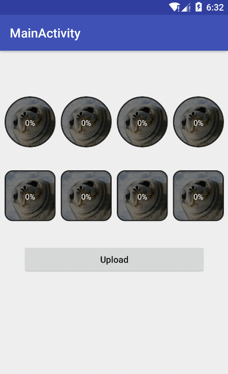

# ImageUploadMask

[  ](https://bintray.com/darren/maven/image-upload-mask/_latestVersion)

## Preview



## Download

```gradle
compile 'com.chenglei.imageuploadmask:image-upload-mask:1.0.0'
```

## Useage

```java
ImageUploadMask mask = new ImageUploadMask.Builder(this)
    .oval(true)
    .direction(ShapeMask.Direction.LTR)
    .maskColorInt(0x88000000)
    .cornerRadius(12)
    .textColorInt(Color.WHITE)
    .textSize(12)
    .margin(1)
    .bind(mImageView1)
    .build();

mask.setProgress(50);
```